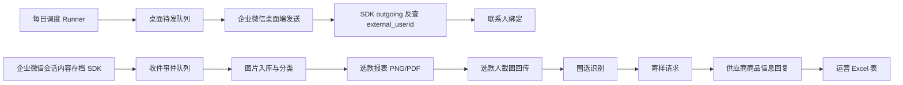

# 服装电商供应商选款自动化 Agent / Fashion Supplier Selection Agent

这是一个面向服装电商团队的自动化 Agent 项目，用来把“每天问供应商新款、收图、分类、生成选款报表、识别选款截图、追寄样和商品信息”这一整条人工流程自动化。

项目定位是作品展示版。仓库只包含代码、测试、示例配置和可生成的 demo 数据；真实联系人、企业微信密钥、会话存档、日志、图片和业务表格都不会提交到 GitHub。

## 解决的问题

服装团队每天会从多个供应商那里收到大量新款图片。人工流程通常要反复做这些事：

- 给供应商发新款询问。
- 接收图片并按供应商、日期归档。
- 去重、合并同款和细节图。
- 生成给选款人的长图/PDF 报表。
- 识别选款人截图圈选的款式。
- 按供应商拆分寄样请求。
- 收集款号、颜色、尺码、材质、价格、库存等运营信息。

这个项目把这些步骤拆成可恢复的状态机。状态机就是把业务步骤记录成明确状态，例如 `pending_ask -> waiting_images -> report_ready -> sample_requested`，程序重启后可以继续推进，不依赖聊天上下文记忆。

## 核心能力

- 供应商和角色管理：供应商、选款人、运营、人工确认人都通过角色表配置。
- 消息收发链路：支持企业微信桌面端发送兜底，也支持企业微信会话内容存档 SDK 拉取消息。
- 官方收图入库：按 `external_userid` 映射供应商，下载图片并写入本地收件事件。
- 桌面/官方映射保护：桌面问款消息带唯一批次码，便于从 SDK outgoing 消息反查官方联系人。
- 图片处理：图片归档、感知哈希去重、同款折叠、主图和细节图保留。
- 视觉分类：支持 Google Gemini / OpenAI 视觉模型，本地规则做兜底。
- 报表生成：输出选款长图、PDF、manifest。
- 圈选识别：识别红色、黄色、蓝色等常见截图标记，并映射回商品 ID。
- 运营表：把选中款和供应商回复整理为结构化 Excel。
- 故障保护：官方收图失败时停机、记录诊断、进入恢复前对账。
- 测试覆盖：核心流程有单元测试覆盖。

## 架构概览



## 快速开始

准备 Python 环境：

```bash
python3 -m venv .venv
.venv/bin/python -m pip install --upgrade pip
.venv/bin/python -m pip install -r requirements.txt
```

初始化 demo 数据：

```bash
.venv/bin/python -m supplier_bot.cli init
.venv/bin/python -m supplier_bot.cli seed-demo
.venv/bin/python -m supplier_bot.cli import-demo-images --date 2026-05-21
.venv/bin/python -m supplier_bot.cli build-report --date 2026-05-21
```

输出会生成在本地 `data/reports/2026-05-21/`，该目录被 `.gitignore` 排除，不会进入 GitHub。

测试截图圈选：

```bash
.venv/bin/python -m supplier_bot.cli make-demo-selection --date 2026-05-21
.venv/bin/python -m supplier_bot.cli detect-selection \
  --date 2026-05-21 \
  --screenshot data/reports/2026-05-21/demo_selection.png
```

运行测试：

```bash
.venv/bin/python -m unittest tests.test_core
```

## 配置

复制示例配置：

```bash
cp .env.example .env
```

默认 `WECOM_DRY_RUN=1`，表示 dry run 模式。dry run 是只模拟发送、不真实触达外部联系人的模式，适合本地 demo 和测试。

常用配置项：

- `RUNTIME_MODE=desktop`：只使用本地桌面端发送和本地测试数据。
- `RUNTIME_MODE=hybrid`：官方会话存档负责收消息，桌面端负责发送。
- `VISION_PROVIDER=auto`：优先使用可用视觉模型，否则本地规则兜底。
- `BOT_DATA_DIR=data`：运行数据目录。

企业微信真实接口、会话内容存档 SDK、SMTP 邮件报警等参数只应写入 `.env` 或部署环境变量，不应提交到仓库。

## 重要安全边界

这个仓库不包含：

- `.env`
- 企业微信密钥、Token、EncodingAESKey
- 会话存档 RSA 私钥
- 真实 `external_userid`
- 真实联系人列表
- 聊天回调事件
- 供应商图片
- 本地数据库
- 日志和生成报表

`.gitignore` 已默认屏蔽这些路径。发布前可以运行：

```bash
git status --short
```

确认只出现代码、测试、文档和示例配置。

## 项目亮点

- 把真实运营流程抽象成可恢复状态机，而不是一次性脚本。
- 同时处理桌面自动化和官方 SDK 两种通道的身份映射问题。
- 对高风险动作设置人工确认边界，例如改地址、付款承诺、价格确认、换款取消。
- 通过 SDK outgoing 消息证明桌面发送对象和官方联系人一致，降低错绑风险。
- 失败后先补拉、再对账、再恢复，避免漏图后继续推进业务。

## 简历说明示例

我做了一个服装电商供应商选款自动化 Agent，用于自动收集供应商新款图、生成选款报表、识别选款人截图圈选，并整理商品信息表。项目使用企业微信消息存档 SDK、桌面发送兜底、图片分类、状态机和恢复对账机制，重点解决真实业务中的异步消息、联系人映射、漏图恢复和人工确认边界。
